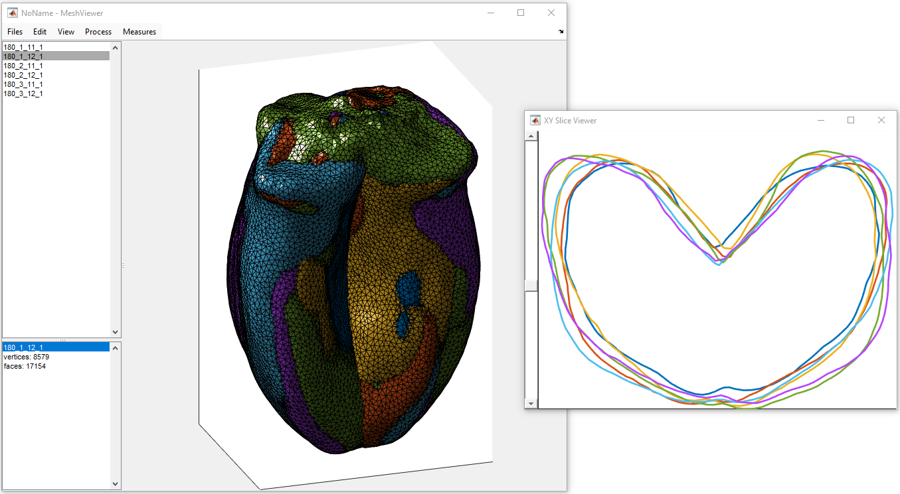

# MeshViewer
Matlab GUI for visualization and manipulation of 3D meshes

This GUI aims at facilitate the visualization and the manipulation of 3D meshes that can be generated during researches. 
It also provides few processing operations to avoid calling specialized software (e.g. MeshLab). 

Among features:

* Simultaneous display of several meshes 
* Import / Export of meshes in a variety of file formats (PLY, OFF...)
* several triangle mesh processing options are provided: simplification, subdivision, smoothing...
* geometric transform of meshes (translation, rotation...)
* interactive display of mesh "Slicing" along main directions.

Please note that the software implements only a limited number of features, and is not optimized
for the management of meshes with large number of vertices.

# Installation

Extract the project, and run the file "MeshViewer.m". 
A default GUI is created, that also allows to open some OFF or PLY files stored on the local computer.

# Dependencies

* [MatGeom Toolbox](https://github.com/mattools/matGeom), for the geometry processing operations
* [GUI Layout V2](https://fr.mathworks.com/matlabcentral/fileexchange/47982-gui-layout-toolbox) for GUI
* [GenericDialog](https://github.com/mattools/GenericDialog), a generic dialog for Matlab, mimicking ImageJ's functionalities
